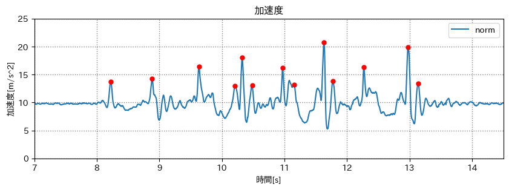

<!--
_class: gaia lead
_paginate: false
-->

# センシング と mocopi

来年の目標にセンシングはどうですか？

 

愛知工業大学 システム工学研究会
B1 多田 隆人

---

<!-- _header: だれ -->

   - 名電 情報科 (2023年卒)
   - 元 情シス部長
   - ぺんぎんがすき　

---

## センシングとは

---

<!-- header: センシングとは -->
<!-- class: lead -->

### 様々な情報を計測してデータ化すること

- 万歩計
- ポケモン GO
- カーナビ etc.

日常の至る所で使われている

---

<!-- header: "" -->
<!-- _class: gaia lead -->

# センシング x mocopi

---

<iframe
   src="https://www.youtube.com/embed/g0d-x0l2HtA?si=XaV0OP78yE2_MYJ2&amp;start=100"
   frameborder="0"
   allow="accelerometer; autoplay; clipboard-write; encrypted-media; gyroscope; picture-in-picture; web-share"
   allowfullscreen
></iframe>

---

<iframe
   src="https://www.youtube.com/embed/s0G8u1el42g?si=HG-GdQhORp0Ll5iC&amp;start=129"
   title="YouTube video player"
   frameborder="0"
   allow="accelerometer; autoplay; clipboard-write; encrypted-media; gyroscope; picture-in-picture; web-share"
   allowfullscreen
></iframe>

---

<!-- header: "" -->

### どこまでできる？
辰巳先生）mocopiで野球のデータ分析をやりたい

---

<!-- header: mocopi の精度 -->

### 腕を上げる
<iframe
   src="https://www.youtube.com/embed/QXMYon2XJrY"
   frameborder="0"
   allow="accelerometer; autoplay; clipboard-write; encrypted-media; gyroscope; picture-in-picture; web-share"
   allowfullscreen
></iframe>

---

<iframe
   src="https://www.youtube.com/embed/ozdsx7HVQww?si=M6v-_RfOUvfzBsxV" 
   title="YouTube video player"
   frameborder="0"
   allow="accelerometer; autoplay; clipboard-write; encrypted-media; gyroscope; picture-in-picture; web-share"
   allowfullscreen
></iframe>

---

(Pythonで簡単に触れるパッケージを自作してたり...)

スタート地点とゴール地点がずれた！

---

センサーには必ず誤差がある
最悪だね

**このデータをどう扱えば良い？**

---

<iframe
   src="https://www.youtube.com/embed/NtCvLE0HBFA"
   title="歩行推定 高大連携LT会用"
   frameborder="0"
   allow="accelerometer; autoplay; clipboard-write; encrypted-media; gyroscope; picture-in-picture; web-share"
   allowfullscreen
></iframe>

---

<!-- header: 歩数推定してみる -->

この加速度から歩数を出してみる

---

必要な部分を切り出す

---

ノルムに変換する ($norm = \sqrt{x^2 + y^2 + z^2}$)

---

滑らかにする(平滑化フィルタ)

---

<!-- _header: 歩数を出してみる -->

うまくいった 😊

---

<!-- _header: これから -->
<!-- _class: center -->

#### mocopiを使って ある動作から積み重なった誤差を減らす研究をしたい

例)
　歩くと必ず足が伸びるタイミングがある
　　↓
　常に曲がっていたらまっすぐになるように補正

---

<!-- _header: まとめ -->

1. センシングは現実世界の情報をデータ化できる
2. データは必ず誤差を含む
3. データをどう扱うかが重要
4. 今後にセンシングはどうですか？
