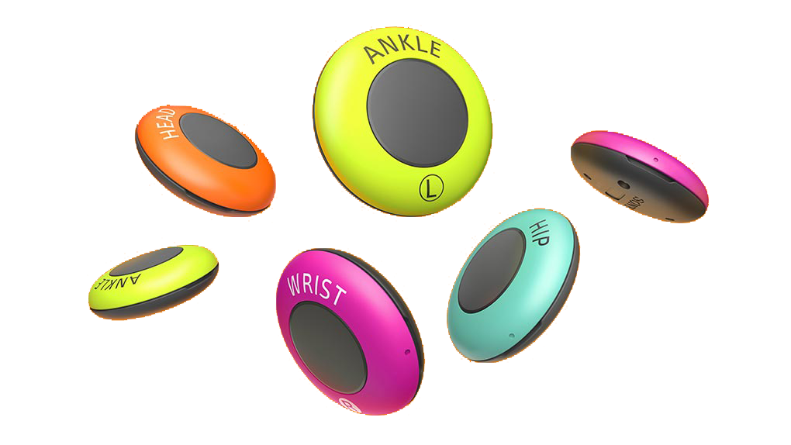

<!--
_class: gaia lead
_paginate: false
-->

# センシング と mocopi

mocopiで研究したい

 

愛知工業大学 システム工学研究会
B1 多田 隆人

---

<!-- _header: "だれ" -->

   - 名電 情報科 (2023年卒)
   - 元 情シス部長
   - ぺんぎんかわいい

---

## mocopi って知ってますか？

---

<!-- _header: "mocopiとは" -->

手軽にモーションキャプチャできるデバイス

---

<iframe
   src="https://www.youtube.com/embed/g0d-x0l2HtA?si=ibJ5f7Qt79tA-3nx&amp;start=103"
   title="YouTube video player"
   frameborder="0"
   allow="accelerometer; autoplay; clipboard-write; encrypted-media; gyroscope; picture-in-picture; web-share"
></iframe>

---

<!-- _header: "実際に試してみる" -->

1. **右手** を **大きく** 挙げる
2. **左手** を **大きく** 挙げる
3. **右手** を **小さく** 挙げる
4. **左手** を **小さく** 挙げる
5. 1回 ジャンプする
6. 2回 ジャンプする

---

TODO: リアルタイムで再生している様子 (VRChat等)

---

<!-- _header: "センシング x mocopi" -->

現実の人物の動きをデータ化できる

#### このデータを使って何かしたい！

### mocopi で研究環境を作ろう

---

<!-- _header: "流れ" -->

1. データをとる
   - mocopiアプリでBVH形式で出力できる
2. データを解析する
   - Python で BVH ファイルを読み込みたい
3. データを可視化する
   - Unity で BVH ファイルを動かしたい
4. データを使って何かする
   - なんかいい感じの研究をしたい

---

<!-- _header: "PythonでBVHを触る" -->
<!-- class:  -->

簡単にBVHファイルを読み込めるパッケージを作る

<pre><code style="height:450px">[BVHファイルの中身]

HIERARCHY
ROOT root
{
  OFFSET 0 93.2929 0
  CHANNELS 6 Xposition Yposition Zposition Zrotation Xrotation Yrotation
  JOINT torso_1
  {
    OFFSET 0 5.07867 -1.15138
    CHANNELS 6 Xposition Yposition Zposition Zrotation Xrotation Yrotation
...
MOTION
Frames: 2085
Frame Time: 0.016667
0 93.2929 0 -0 0 -0 0 5.07867 -1.15138 -0 0 -0 0 5.61661 1.07143 -0 0 -0 -1.02604e-17 5.98978 0.11501 -0 0 -0 -1.10457e-17 6.50583 -0.443523 -0 0 -0 -1.97295e-17 7.60548 -1.50593 -0 0 -0 -2.53307e-17 9.49737 -0.914492 -0 0 -0 -2.90401e-17 10.5513 1.57691 -0 0 -0 -1.29193e-17 4.78644 0.715339 -0 0 -0 -1.8116e-17 4.82109 0.421791 -0 0 -0 -2.00958e-17 4.83041 0.765062 -0 0 -0 1.23299 -7.60731 7.53374 -0 0 -0 12.9547 3.2495 -3.26872 -0 0 -0 29.2081 0.0598081 0.137039 -0 0 -0 24.234 0.0496219 0.113701 -0 0 -0 -1.23299 -7.60729 7.53365 -0 0 -0 -12.9547 3.2495 -3.26872 -0 0 -0 -29.2081 0.0598081 0.137039 -0 0 -0 -24.234 0.0496218 0.113702 -0 0 -0 9.23673 -4.20556 2.0327 -0 0 -0 -0.852353 -38.7721 -0.655187 -0 0 -0 -2.32622 -40.4017 -6.04875 -0 0 -0 0.779096 -9.8844 12.4959 -0 0 -0 -9.23673 -4.20556 2.0327 -0 0 -0 0.852353 -38.7721 -0.655187 -0 0 -0 2.32622 -40.4017 -6.04875 -0 0 -0 -0.779096 -9.8844 12.4959 -0 0 -0 
6.21186 93.2044 -14.5364 -0.124976 1.05047 71.1335 0 5.07867 -1.15138 0.123686 -1.25657 1.45728 0 5.61661 1.07143 -0.423908 0.0859539 1.46572 -1.02604e-17 5.98978 0.11501 -0.662855 1.98076 1.39555 -1.10457e-17 6.50583 -0.443523 -0.988923 5.08643 1.35645 -1.97295e-17 7.60548 -1.50593 -0.975523 6.29366 1.47728 -2.53307e-17 9.49737 -0.914492 -0.675669 7.13512 1.60268 -2.90401e-17 10.5513 1.57691 -0.0167734 0.0897245 -0.0377506 -1.29193e-17 4.78644 0.715339 -1.23952 15.7097 3.47941 -1.8116e-17 4.82109 0.421791 -2.77631 9.48662 1.33685 -2.00958e-17 4.83041 0.765062 -3.68911 20.393 2.41253 1.23299 -7.60731 7.53374 -1.84188 -0.198528 -5.19825 12.9547 3.2495 -3.26872 -84.8342 11.5826 -14.1351 29.2081 0.0598081 0.137039 1.1977 -0.0541852 -5.78216 24.234 0.0496219 0.113701 1.01588 -17.0156 -1.05335 -1.23299 -7.60729 7.53365 -7.33263 -3.39849 0.405009 -12.9547 3.2495 -3.26872 68.2989 47.3662 26.8089 -29.2081 0.0598081 0.137039 -11.0564 -7.26787 67.1377 -24.234 0.0496218 0.113702 2.81157 -53.9896 5.32724 9.23673 -4.20556 2.0327 2.1247 -4.40199 -12.5331 -0.852353 -38.7721 -0.655187 -0.761171 2.8428 -0.0307406 -2.32622 -40.4017 -6.04875 -1.68667 0.608626 15.2821 0.779096 -9.8844 12.4959 4.96962e-17 -7.95139e-16 1.2424e-17 -9.23673 -4.20556 2.0327 0.0267482 -1.38766 27.6213 0.852353 -38.7721 -0.655187 0.285401 1.06553 0.0159454 2.32622 -40.4017 -6.04875 -2.12731 -0.845264 -14.9591 -0.779096 -9.8844 12.4959 -2.64064e-16 -5.7985e-16 -1.27575e-14 
6.21093 93.2043 -14.5323 -0.127236 1.05041 71.1499 0 5.07867 -1.15138 0.12438 -1.27058 1.4581 0 5.61661 1.07143 -0.423433 0.0764714 1.46634 -1.02604e-17 5.98978 0.11501 -0.662557 1.97677 1.39618 -1.10457e-17 6.50583 -0.443523 -0.988869 5.09058 1.35704 -1.97295e-17 7.60548 -1.50593 -0.975623 6.30295 1.47792 -2.53307e-17 9.49737 -0.914492 -0.675925 7.14717 1.60364 -2.90401e-17 10.5513 1.57691 -0.0167661 0.0895575 -0.0377499 -1.29193e-17 4.78644 0.715339 -1.24053 15.7229 3.48086 -1.8116e-17 4.82109 0.421791 -2.77193 9.49033 1.33781 -2.00958e-17 4.83041 0.765062 -3.67867 20.3936 2.42008 1.23299 -7.60731 7.53374 -1.83983 -0.208131 -5.1916 12.9547 3.2495 -3.26872 -84.846 11.5685 -14.1371 29.2081 0.0598081 0.137039 1.19597 -0.0540196 -5.77381 24.234 0.0496219 0.113701 1.02842 -16.9697 -1.04228 -1.23299 -7.60729 7.53365 -7.33491 -3.40483 0.399009 -12.9547 3.2495 -3.26872 68.3032 47.3648 26.805 -29.2081 0.0598081 0.137039 -11.0557 -7.26628 67.1295 -24.234 0.0496218 0.113702 2.81224 -53.9716 5.3317 9.23673 -4.20556 2.0327 2.1271 -4.4171 -12.5537 -0.852353 -38.7721 -0.655187 -0.766451 2.86253 -0.030822 -2.32622 -40.4017 -6.04875 -1.68941 0.60539 15.2829 0.779096 -9.8844 12.4959 4.96962e-17 -7.95139e-16 1.2424e-17 -9.23673 -4.20556 2.0327 0.0283622 -1.3862 27.6077 0.852353 -38.7721 -0.655187 0.284568 1.06242 0.0159066 2.32622 -40.4017 -6.04875 -2.12491 -0.845244 -14.959 -0.779096 -9.8844 12.4959 -5.95368e-16 -5.59143e-16 -1.27471e-14 
6.20937 93.2037 -14.5285 -0.128388 1.05136 71.1586 0 5.07867 -1.15138 0.123411 -1.28773 1.45783 0 5.61661 1.07143 -0.423991 0.0648007 1.46551 -1.02604e-17 5.98978 0.11501 -0.66292 1.97236 1.39525 -1.10457e-17 6.50583 -0.443523 -0.989004 5.09683 1.35596 -1.97295e-17 7.60548 -1.50593 -0.97584 6.31601 1.47683 -2.53307e-17 9.49737 -0.914492 -0.676571 7.16371 1.60268 -2.90401e-17 10.5513 1.57691 -0.0167692 0.089317 -0.0377797 -1.29193e-17 4.78644 0.715339 -1.24196 15.7401 3.48396 -1.8116e-17 4.82109 0.421791 -2.77164 9.49105 1.33929 -2.00958e-17 4.83041 0.765062 -3.68672 20.3949 2.42938 1.23299 -7.60731 7.53374 -1.83458 -0.223967 -5.181 12.9547 3.2495 -3.26872 -84.8559 11.5655 -14.1312 29.2081 0.0598081 0.137039 1.19498 -0.0539241 -5.76898 24.234 0.0496219 0.113701 1.02944 -16.9517 -1.02989 -1.23299 -7.60729 7.53365 -7.34122 -3.4176 0.389238 -12.9547 3.2495 -3.26872 68.3093 47.3683 26.811 -29.2081 0.0598081 0.137039 -11.0544 -7.26332 67.1141 -24.234 0.0496218 0.113702 2.81004 -53.9143 5.32513 9.23673 -4.20556 2.0327 2.12688 -4.42138 -12.5513 -0.852353 -38.7721 -0.655187 -0.767074 2.86485 -0.0308315 -2.32622 -40.4017 -6.04875 -1.68317 0.606395 15.2825 0.779096 -9.8844 12.4959 4.96962e-17 -7.95139e-16 1.2424e-17 -9.23673 -4.20556 2.0327 0.0296259 -1.38483 27.6043 0.852353 -38.7721 -0.655187 0.283564 1.05867 0.0158597 2.32622 -40.4017 -6.04875 -2.12907 -0.845237 -14.9581 -0.779096 -9.8844 12.4959 -9.26676e-16 -5.48759e-16 -1.27264e-14 
6.20748 93.2032 -14.5254 -0.129506 1.05075 71.1665 0 5.07867 -1.15138 0.12362 -1.30513 1.45782 0 5.61661 1.07143 -0.423725 0.0531631 1.46506 -1.02604e-17 5.98978 0.11501 -0.662816 1.96844 1.39466 -1.10457e-17 6.50583 -0.443523 -0.989072 5.1042 1.35523 -1.97295e-17 7.60548 -1.50593 -0.976335 6.3306 1.4761 -2.53307e-17 9.49737 -0.914492 -0.677861 7.182 1.60231 -2.90401e-17 10.5513 1.57691 -0.0167723 0.0890567 -0.0378072 -1.29193e-17 4.78644 0.715339 -1.24537 15.7618 3.49531 -1.8116e-17 4.82109 0.421791 -2.77498 9.48964 1.34469 -2.00958e-17 4.83041 0.765062 -3.68895 20.3842 2.43749 1.23299 -7.60731 7.53374 -1.82924 -0.242431 -5.16834 12.9547 3.2495 -3.26872 -84.8687 11.5563 -14.1312 29.2081 0.0598081 0.137039 1.1941 -0.0538401 -5.76474 24.234 0.0496219 0.113701 1.02835 -16.9181 -1.022 -1.23299 -7.60729 7.53365 -7.34987 -3.43106 0.377662 -12.9547 3.2495 -3.26872 68.3203 47.3689 26.816 -29.2081 0.0598081 0.137039 -11.0524 -7.25863 67.0898 -24.234 0.0496218 0.113702 2.78872 -53.8468 5.30212 9.23673 -4.20556 2.0327 2.12866 -4.42595 -12.5545 -0.852353 -38.7721 -0.655187 -0.768139 2.86883 -0.0308476 -2.32622 -40.4017 -6.04875 -1.68116 0.60509 15.2826 0.779096 -9.8844 12.4959 3.13757e-16 -7.86887e-16 4.17215e-18 -9.23673 -4.20556 2.0327 0.0327399 -1.38905 27.6029 0.852353 -38.7721 -0.655187 0.285397 1.06552 0.0159452 2.32622 -40.4017 -6.04875 -2.12975 -0.847866 -14.9578 -0.779096 -9.8844 12.4959 -4.65802e-16 -5.71414e-16 -1.2747e-14 
6.2056 93.203 -14.523 -0.130639 1.05091 71.1748 0 5.07867 -1.15138 0.122616 -1.3206 1.45803 0 5.61661 1.07143 -0.424407 0.0429527 1.4648 -1.02604e-17 5.98978 0.11501 -0.663369 1.96529 1.39432 -1.10457e-17 6.50583 -0.443523 -0.989483 5.11143 1.35477 -1.97295e-17 7.60548 -1.50593 -0.976844 6.34446 1.47574 -2.53307e-17 9.49737 -0.914492 -0.678633 7.1992 1.60228 -2.90401e-17 10.5513 1.57691 -0.0167667 0.0888089 -0.0378157 -1.29193e-17 4.78644 0.715339 -1.24681 15.7787 3.49862 -1.8116e-17 4.82109 0.421791 -2.7742 9.48508 1.3464 -2.00958e-17 4.83041 0.765062 -3.69467 20.3723 2.44884 1.23299 -7.60731 7.53374 -1.8275 -0.258169 -5.15762 12.9547 3.2495 -3.26872 -84.8749 11.5533 -14.1337 29.2081 0.0598081 0.137039 1.19421 -0.0538509 -5.76528 24.234 0.0496219 0.113701 1.02312 -16.8923 -1.02221 -1.23299 -7.60729 7.53365 -7.35437 -3.44263 0.367415 -12.9547 3.2495 -3.26872 68.3265 47.3671 26.8169 -29.2081 0.0598081 0.137039 -11.0506 -7.25443 67.068 -24.234 0.0496218 0.113702 2.77601 -53.8374 5.29088 9.23673 -4.20556 2.0327 2.12963 -4.43033 -12.563 -0.852353 -38.7721 -0.655187 -0.76883 2.87141 -0.0308581 -2.32622 -40.4017 -6.04875 -1.68127 0.605406 15.2828 0.779096 -9.8844 12.4959 4.47266e-16 -7.82715e-16 3.05504e-33 -9.23673 -4.20556 2.0327 0.0347786 -1.39336 27.5948 0.852353 -38.7721 -0.655187 0.287092 1.07185 0.0160241 2.32622 -40.4017 -6.04875 -2.12946 -0.8498 -14.9576 -0.779096 -9.8844 12.4959 -3.96584e-16 -5.71568e-16 -1.27533e-14 
...
</code></pre>

---

<!-- _header: "PythonでBVHを触る" -->
<!-- _class:  -->

簡単にBVHファイルを読み込めるパッケージを作った

> pip install mcp-persor

<pre><code style="height:370px">
from mcp_persor import BVHparser

# BVHファイル読み込み
bvhp = BVHparser('path/to/input.bvh')

# dataframeで取得
motion_df = bvhp.get_motion_df()

# あとはpandasで好きに (X軸方向に10動かす)
motion_df['root']['Xposition'] += 10

# BVHファイルに書き出す
bvhp.set_motion_df(motion_df)
bvhp.write('path/to/output.bvh')
</code></pre>

---

<!-- _header: "UnityでBVHを動かす" -->

UnityからBVHは直接読み込めないため、
いったんFBXに変換する必要がある

BVH → FBX(Blender) → Unity

---

TODO: Unityで動きを再生する様子

---

<!-- _header: "データを使って何かする" -->

