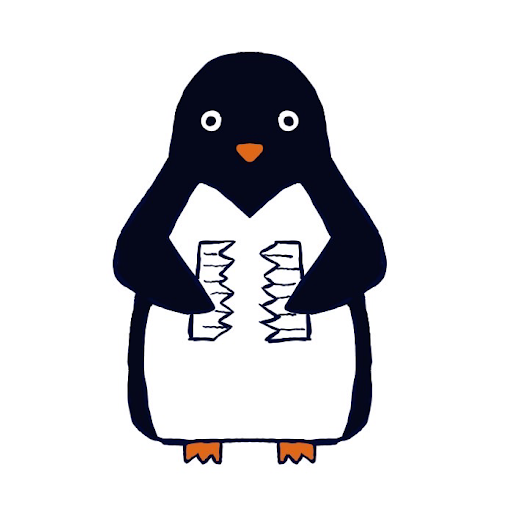
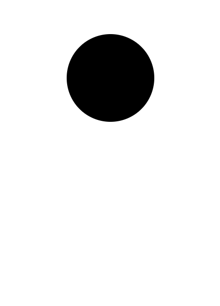
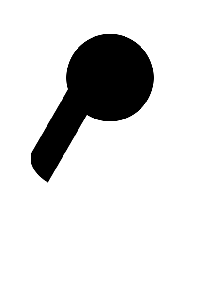
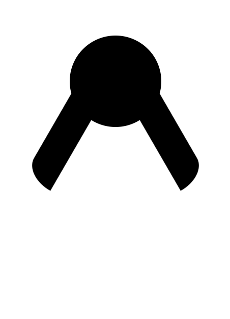
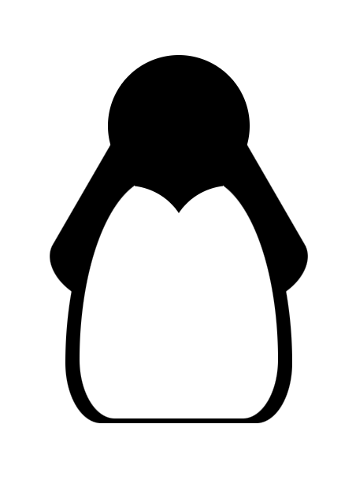
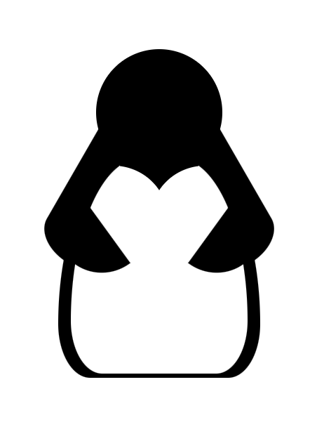
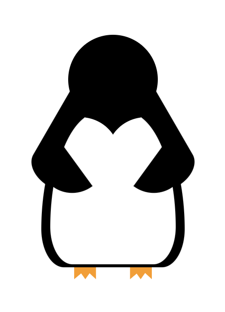
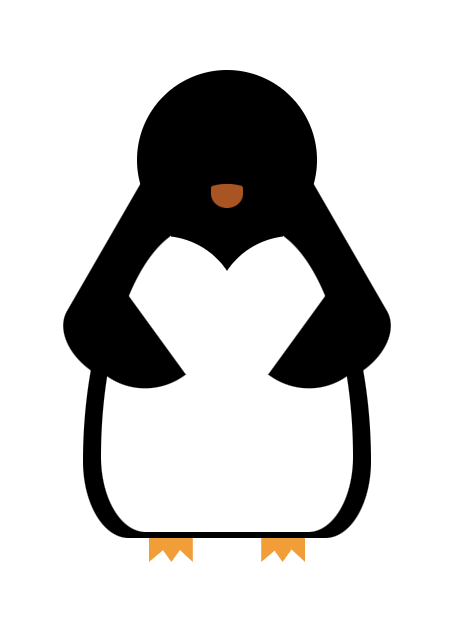
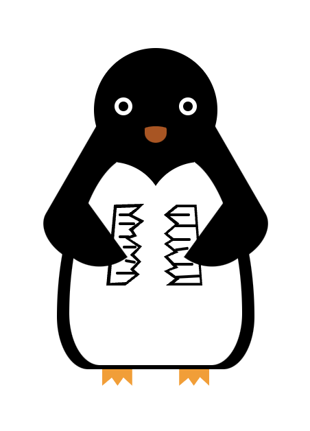
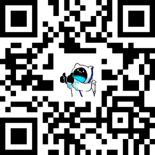

<!--
_class: gaia lead
_paginate: false
-->

# CSS のすゝめ

<br>

システム工学研究会
B2 ~~多田 隆人~~ **佐藤さとる**

---

<!-- _header: だれ -->



<div style="margin-left:570px">

- (自称)フロントエンドエンジニア
- ペンギンがすき
- TODO

<div style="padding-top: 30px">
  <p>
    <svg xmlns="http://www.w3.org/2000/svg" width="40" height="40" viewBox="0 0 14 14" style="vertical-align: sub"><g fill="none"><g clip-path="url(#primeTwitter0)"><path fill="currentColor" d="M11.025.656h2.147L8.482 6.03L14 13.344H9.68L6.294 8.909l-3.87 4.435H.275l5.016-5.75L0 .657h4.43L7.486 4.71zm-.755 11.4h1.19L3.78 1.877H2.504z"/></g><defs><clipPath id="primeTwitter0"><path fill="#fff" d="M0 0h14v14H0z"/></clipPath></defs></g></svg>
    <span>:@SatooRu65536</span>
  </p>
</div>

</div>

---

### イラストツールは何を使っていますか？

<div style="margin-left:400px">

- illustrator
- Figma
- ibisPaint etc.

</div>

---

### CSS はいかがですか？

---

<!-- _header: CSS とは -->

<div style="margin-left:200px">

- お絵描き言語の1つ
- 
- 
- 

</div>

---

<!-- _header: CSS とは -->

<div style="margin-left:200px">

- お絵描き言語の1つ
- アニメーションもつけれる
- 
- 

</div>

---

<!-- _header: CSS とは -->

<div style="margin-left:200px">

- お絵描き言語の1つ
- アニメーションもつけれる
- 3D表現もできる
- 

</div>

---

<!-- _header: CSS とは -->

<div style="margin-left:200px">

- お絵描き言語の1つ
- アニメーションもつけれる
- 3D表現もできる
- Webページのスタイルを指定することもできる

</div>

---

### CSS の使い方

---

<!-- _header: CSS の使い方 -->



<div style="margin-left:570px">

```html
<div></div>
```

```css
div {
  background-color: var(--black);
  width: 30%;
  aspect-ratio: 1/1;
  border-radius: 50%;
  top: 9%;
  left: calc(50% - 15%);
}
```

</div>

---

<!-- _header: CSS の使い方 -->



<div style="margin-left:570px">

```html
<div></div>
```

```css
div {
  background-color: var(--black);
  height: 30px;
  width: 100px;
  top: 38%;
  rotate: -60deg;
  left: 16%;
  border-top-left-radius: 20% 100%;
}
```

</div>

---

<!-- _header: CSS の使い方 -->



<div style="margin-left:570px">

```html
<div></div>
```

```css
div {
  background-color: var(--black);
  height: 30px;
  width: 100px;
  top: 38%;
  rotate: 60deg;
  right: 16%;
  border-top-right-radius: 20% 100%;
}
```

</div>

---

<!-- _header: CSS の使い方 -->


<div style="margin-left:570px">

```css
div.left {
  background-color: var(--white);
  width: 31px;
  height: 23px;
  clip-path: ellipse(39px 38px at -14% 179%);
  top: 35.6%;
  left: 40.5%;
  z-index: 3;
}

div.right {
  background-color: var(--white);
  width: 31px;
  height: 23px;
  clip-path: ellipse(39px 38px at 114% 179%);
  top: 35.6%;
  right: 40.5%;
  z-index: 3;
}
```

</div>

---

<!-- _header: CSS の使い方 -->



<div style="margin-left:570px">

```css
/* 省略 */
```

</div>

---

<!-- _header: CSS の使い方 -->



<div style="margin-left:570px">

```css
/* 省略 */
```

</div>

---

<!-- _header: CSS の使い方 -->



<div style="margin-left:570px">

```css
/* 省略 */
```

</div>

---

<!-- _header: CSS の使い方 -->



<div style="margin-left:570px">

```css
/* 省略 */
```

</div>

---

<!-- _header: CSS の使い方 -->


<div style="margin-left:570px">

```css
/* 省略 */
```

</div>

---

<!-- _header: CSS の使い方 -->



<div style="margin-left:570px; scale: 0.3">

```css
.📃 {
  width: 70px;
  height: 62px;
  position: absolute;
  top: 46%;
  left: 38%;
  z-index: 4;
}

.📃 .left,
.📃 .right {
  width: 100%;
  height: 100%;
  position: absolute;
  top: 0;
}

.📃 .left::before,
.📃 .left::after,
.📃 .right::before,
.📃 .right::after {
  content: '';
  width: 40%;
  height: 100%;
  display: block;
  position: absolute;
}

.📃 .left::before {
  background-color: var(--black);
  clip-path: polygon(20% 5%, 99% 4%, 68% 17%, 99% 24%, 70% 35%, 80% 42%, 61% 45%, 93% 54%, 73% 64%, 91% 72%, 72% 81%, 87% 87%, 50% 100%, 0 100%);
}

.📃 .left::after {
  background-color: var(--white);
  clip-path: polygon(27% 9%, 81% 8%, 53% 17%, 86% 25%, 58% 34%, 69% 40%, 48% 44%, 83% 55%, 62% 64%, 81% 72%, 62% 81%, 76% 87%, 51% 96%, 10% 97%);
}

.📃 .left div {
  position: absolute;
  background-color: var(--black);
  z-index: 6;
}

.📃 .left div:nth-child(1) {
  height: 2px;
  width: 8px;
  top: 15%;
  left: 13%;
  border-radius: 999px;
}

.📃 .left div:nth-child(2) {
  height: 2px;
  width: 12px;
  top: 26%;
  left: 13%;
  border-radius: 999px;
}

.📃 .left div:nth-child(3) {
  height: 2px;
  width: 8px;
  top: 41%;
  left: 13%;
  border-radius: 999px;
}

.📃 .left div:nth-child(4) {
  height: 2px;
  width: 10px;
  top: 53%;
  left: 17%;
  border-radius: 999px;
}

.📃 .left div:nth-child(5) {
  height: 2px;
  width: 8px;
  top: 70%;
  left: 19%;
  border-radius: 999px;
  rotate: 10deg;
}

.📃 .left div:nth-child(6) {
  height: 2px;
  width: 15px;
  top: 84%;
  left: 10%;
  border-radius: 999px;
}

.📃 .right::before,
.📃 .right::after {
  right: 0;
  top: 0;
}

.📃 .right::before {
  background-color: var(--black);
  clip-path: polygon(32% 5%, 85% 5%, 100% 100%, 5% 100%, 28% 92%, 0% 83%, 25% 78%, 0% 66%, 25% 60%, 0% 51%, 18% 46%, 0% 39%, 29% 28%, 0% 17%);
}

.📃 .right::after {
  background-color: var(--white);
  clip-path: polygon(36% 8%, 79% 8%, 94% 97%, 27% 97%, 41% 92%, 13% 83%, 38% 79%, 11% 66%, 38% 61%, 11% 51%, 30% 46%, 10% 39%, 40% 27%, 11% 17%);
}

.📃 .right div {
  position: absolute;
  background-color: var(--black);
  z-index: 6;
}

.📃 .right div:nth-child(1) {
  height: 2px;
  width: 16px;
  top: 15%;
  right: 13%;
  border-radius: 999px;
}

.📃 .right div:nth-child(2) {
  height: 2px;
  width: 17px;
  top: 28%;
  right: 5%;
  border-radius: 999px;
}

.📃 .right div:nth-child(3) {
  height: 2px;
  width: 14px;
  top: 44%;
  right: 12%;
  border-radius: 999px;
}

.📃 .right div:nth-child(4) {
  height: 2px;
  width: 10px;
  top: 56%;
  right: 14%;
  rotate: -8deg;
  border-radius: 999px;
}

.📃 .right div:nth-child(5) {
  height: 2px;
  width: 15px;
  top: 73%;
  right: 9%;
  border-radius: 999px;
}

.📃 .right div:nth-child(6) {
  height: 2px;
  width: 18px;
  top: 88%;
  right: 2%;
  border-radius: 999px;
  rotate: -3deg;
}

```

</div>

---

<!-- _header: CSS の使い方 -->


<div 
  style="
    position: fixed;
    bottom: 10px;
    left: 180px;
  "
>
  <p>CSSで書いたアイコン</p>
</div>


<!-- _header: CSS の使い方 -->


<div 
  style="
    position: fixed;
    bottom: 10px;
    right: 320px;
  "
>
  <p>元のアイコン</p>
</div>

---

### CSS はイラストを描けます!!
他には...?

---

### スライドを作ることもできます!!


<a href="https://marp.app/">https://marp.app/</a>

他には...?

---

### 3DCGも作れます!!

<video
  src="./videos/dice.mov"
  style="
    width: 500px;
    position: relative;
  "
  autoplay
  loop
  muted
/>

---

### まとめ

<div
  style="
    margin-left: 450px;
    width: 200px;
    border: 1px solid black;
  "
>
  <p style="text-wrap: nowrap; text-align: left">CSSと</p>
  <p style="text-wrap: nowrap; text-align: left">仲良くしましょう</p>
</div>

---

<div
  style="
    margin-top: 50px;
    margin-inline: auto;
    display: flex;
    gap: 100px;
  "
>
  <div style="text-align: center">
    
    <p>matsuriba.satooru.me</p>
  </div>

  <div style="text-align: center">
    
    <p>satooru.me</p>
  </div>
</div>
